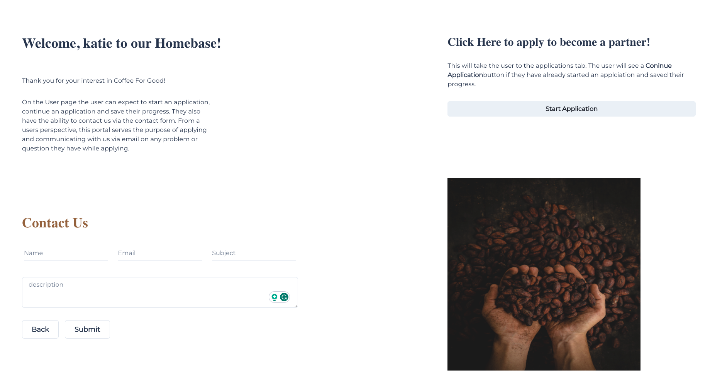
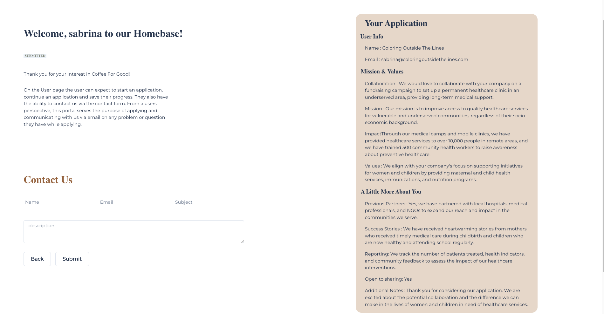
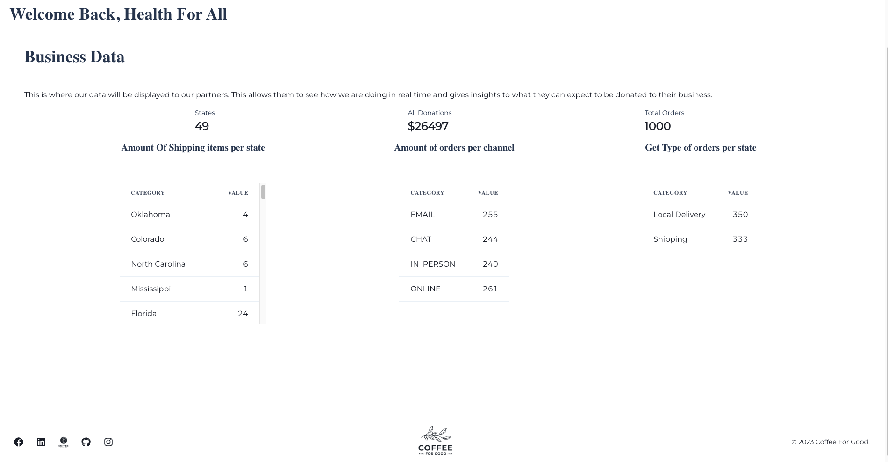
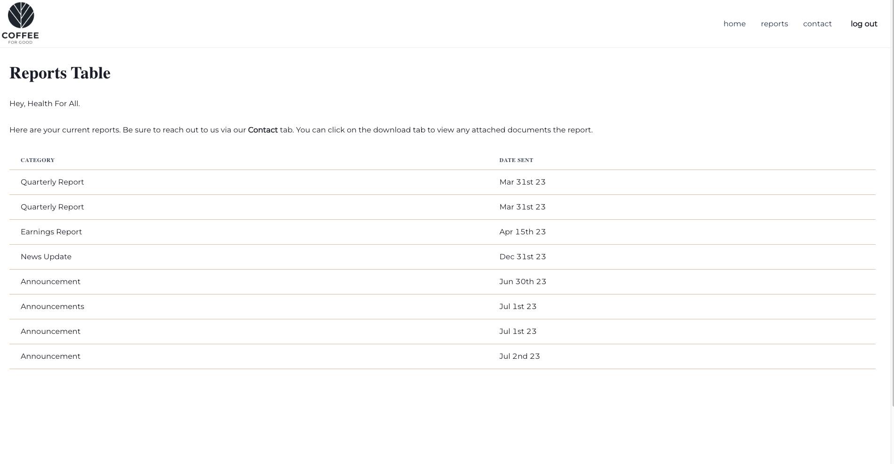
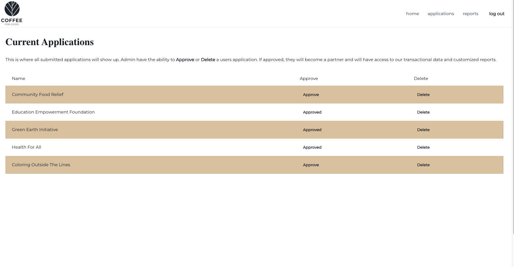
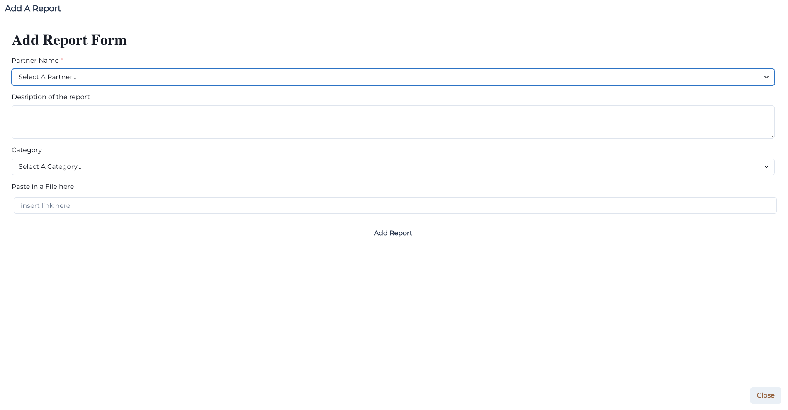
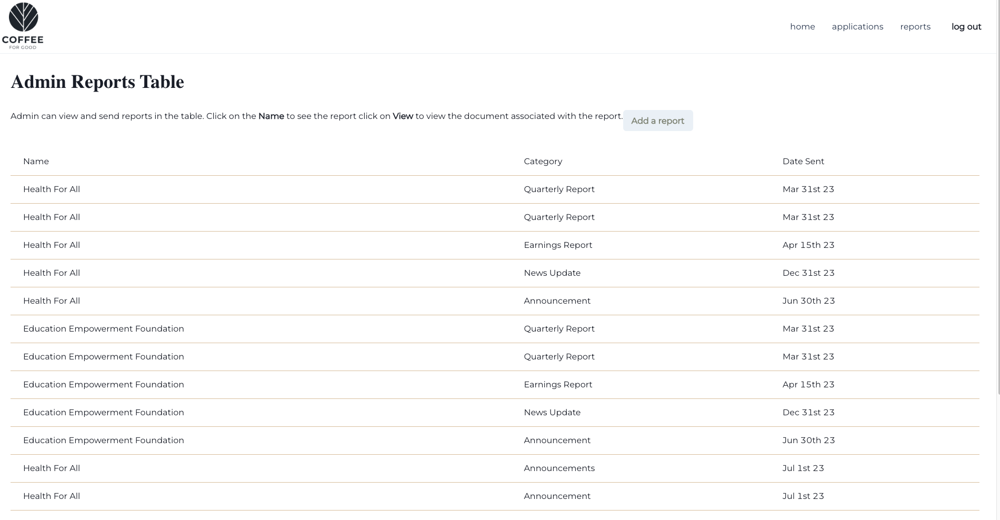

# Homebase

Welcome to my solo project, Homebase!. 

This project successfully solves multiple pain-points for the business Coffee For Good. Coffee For Good is a coffee roasting business gives 50% if its profits to non-profits who help women and children in need.

  1.  Homebase gives Coffee For Good the ability to streamline the application process by allowing potential partners to apply so they can keep track of current applicants. 
  2. Homebase also allows them to have a direct line of communication with their users throught the contact us form. 
  3. Most importantly, it allows for full transperancy with partners to view Coffee For Goods transactional data, so that their partners know how much they can expect to be donated to them during their time as a partner.

## Getting Started

### Prerequisites

- install Node.Js
- install npm
- install PostgreSQL
- Fork and clone this repo
- create a new database, I have mine named `solo-project` but you can name yours whatever you like, just remember to change it in the `modules/pool.js` file
- run npm install to get the dependencies downloaded
- create a .env file with a `SERVER_SESSION_SECRET=superDuperSecret` for security reasons
- Run `npm run server` in one terminal
- open a second terminal if you would like and run `npm run client`
- One admin in particular is necessary for this project to be used completed, you can do this by running this line in Postico
`UPDATE "user" SET "is_admin"=true WHERE "id"=1;` assuming you are the first person. 

### Server and API 

It is important to know that there are three separate user types for this project. 
  1. a user
  2. a partner
  3. an admin

There are protected routes for each of these users. Make sure to look at those in the `ProtectedRoute` folder.

### Images of different pages

### Highlighted Technologies

I had a lot of fun making this project. I learned a lot about what it means to make design decisions and balance changes.
Some of my favorite technologies I used in this project include

- Chakra UI
- Moment.Js
- Redux
- Redux Saga
- Nodemailer

## Special Thanks

A Huge Thanks to the EDA staff, Blaine, Mason, and Katie for all of the help and encouragement through this project. A huge thanks to Kord, Jack, Travis, Garrett, Sawyer, and Zekefor making the den such a fun place to come learn and be challenged. A huge thanks for my wife Sage for being the best support I could ask for. Thanks to my mentors Adrian, Jide, Jason, and Anthony for always challenging me and supporting my growth as a developer.